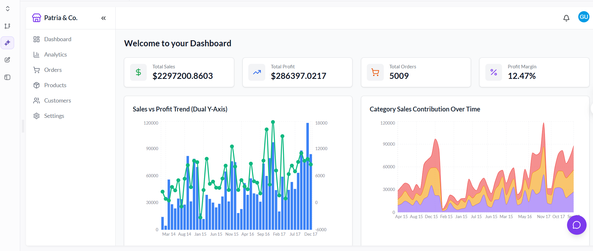

# E-commerce Analytics Dashboard



A production-ready analytics dashboard built with Reflex for real-time e-commerce performance monitoring.

## Overview

- **Total Sales**: $2.29M
- **Total Profit**: $286K  
- **Total Orders**: 5,009
- **Profit Margin**: 12.47%

## Features

- Real-time sales and profit tracking
- Interactive trend analysis (2015-2017)
- Category performance visualization
- Responsive Reflex components

## Tech Stack

```python
Reflex 0.3+
Python 3.10+
Plotly/Recharts
PostgreSQL
```

## Quick Start

```bash
git clone https://github.com/Harrypatria/E-commerce-Analytical-Dashboard
cd E-commerce-Analytical-Dashboard
pip install reflex
reflex run
```

Visit `http://localhost:3000`

## Project Structure

```
src/
├── app.py
├── components/
│   ├── charts.py
│   ├── metrics.py
│   └── layout.py
├── data/
│   └── processors.py
└── state.py
```

## Deployment

```bash
reflex deploy
```

## Data Integration

- E-commerce platform APIs
- Payment processor webhooks  
- Inventory management systems
- CRM data streams

<div align="center">

## 🌟 Support This Project
**Follow me on GitHub**: [](https://github.com/Harrypatria?tab=followers)
**Star this repository**: [](https://github.com/Harrypatria/SQLite_Advanced_Tutorial_Google_Colab/stargazers)
**Connect on LinkedIn**: [](https://www.linkedin.com/in/harry-patria/)

Click the buttons above to show your support!
</div>

